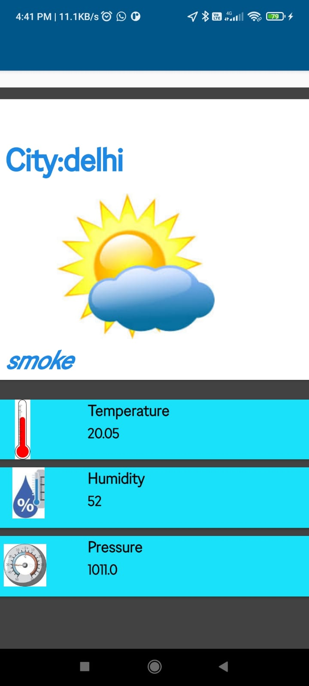

# Weather-Application
This application provides all the information regarding weather.
Information includes climate,temperature,humidity,pressure,etc.
This application uses Waether API to fetch the realtime information of weather.

# Screenshots

